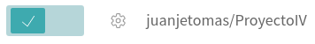
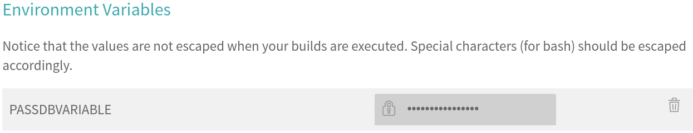

# Hito 2: Integración continua en el repositorio
En primer lugar, he creado el archivo _requirements.txt_ que contiene las dependencias de mi aplicación, que por ahora son pocas:

``` python
Django==1.7
django-registration==2.1.2
psycopg2==2.6.2
```

Para realizar la integración continua, han de realizarse una serie de tests. En mi caso, he optado por utilizar la herramienta integrada que usa Django ([testing in Django](https://docs.djangoproject.com/es/1.10/topics/testing/)).

Estos se incluyen en el archivo _tests.py_ que se muestra a continuación (los test se iran ampliando según las necesidades de la aplicación):

```python
from django.test import TestCase

from rango.models import Bares
from rango.models import Tapas
from rango.forms import BaresForm
from rango.forms import TapasForm
from .views import *
from django.test.client import Client
import unittest
from django.core.urlresolvers import reverse


# Create your tests here.

class BaresTestCase(TestCase):
    def test_check_form_bar(self):
        formdata = {
            'nombre':'nombretest',
            'visitas': 5,
            'direccion': 'nombrestest',
        }
        form = BaresForm(data=formdata)
        self.assertTrue(form.is_valid())
        print "\nEl formulario utilizado es válido"

    def test_save_bar(self):
        formdata = {
            'nombre':'nombretest',
            'visitas': '5',
            'direccion': 'nombrestest',
        }
        form = BaresForm(data=formdata)
        form.save(commit=True);
        global lista
        try:
            lista = Bares.objects.get(slug="nombretest")
        except Bares.DoesNotExist:
            lista=[]
        self.assertTrue(lista)
        print  "\n" + lista.nombre
        print "\nEl bar se ha guardado correctamente"

    def test_show_bares(self):
        formdata = {
            'nombre':'nombretest2',
            'visitas': '6',
            'direccion': 'nombrestest2',
        }
        form = BaresForm(data=formdata)
        form.save(commit=True);

        formdata = {
            'nombre':'nombretest3',
            'visitas': '9',
            'direccion': 'nombrestest3',
        }
        form = BaresForm(data=formdata)
        form.save(commit=True);
    	bares_list = Bares.objects.order_by('-visitas')[:10]
        nbar = 1
    	for bar in bares_list:
            print "\nBar " +str(nbar) + " " + bar.nombre
            nbar = nbar+1
        print "\nLista de bares accedida correctamente"

class TestStringMethods(unittest.TestCase):
	def test_index(self):

		c = Client()

		respose = c.get(reverse('index'))
		self.assertEqual(respose.status_code,200)
        print "\nAcceso correcto como cliente"
```

Una vez hecho esto, mediante el comando
```bash
python manage.py test
```
Se ejecutan los test tal y como se aprecia en la prueba local (aunque con la base de datos ya en AWS):


Para realizar la integración contínua con Travis, se crea el archivo _.travis.yml_ que especifica las características del entorno en el que se ejecutarán los test, como el lenguaje usado, las ramas a testear, la instalación de requisitos y la ejecución de las pruebas:

```yml
build_environment: Ubuntu 16.04
# Únicas ramas que ejecutan test
branches:
  only:
  - master

language: python

python:
  - 2.7

install:
  - pip install -r requirements.txt

script:
  - python manage.py test
```

Activamos el acceso al repositorio del proyecto:



Y establecemos las variables de entorno (en este caso se almacena la contraseña de la base de datos)


