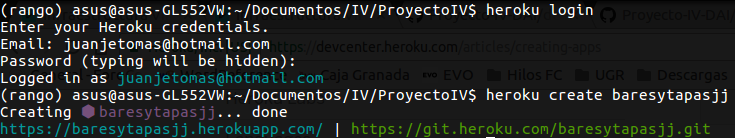
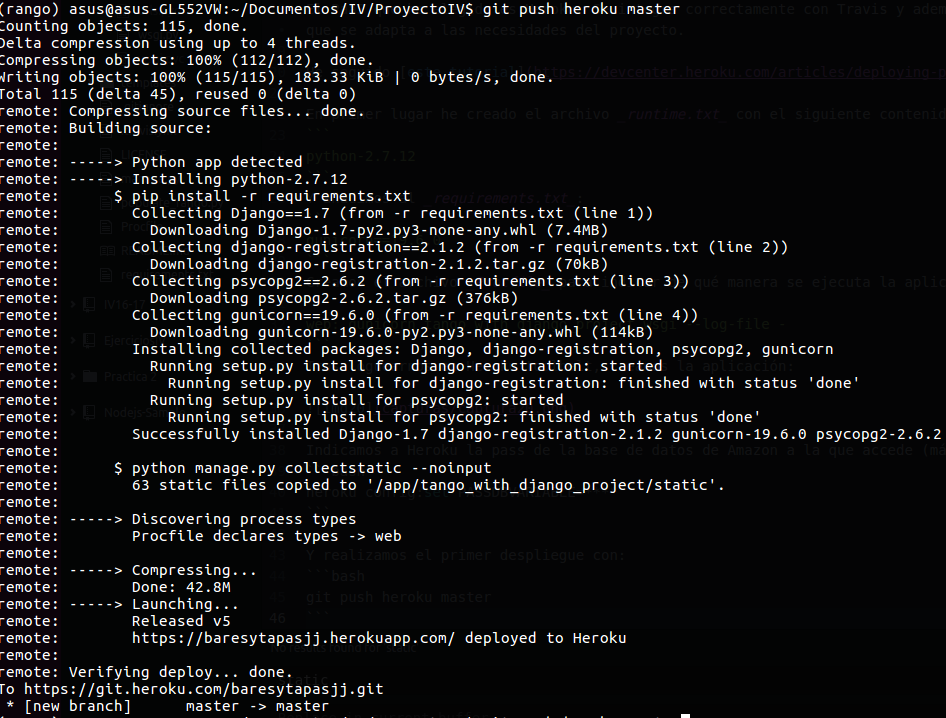
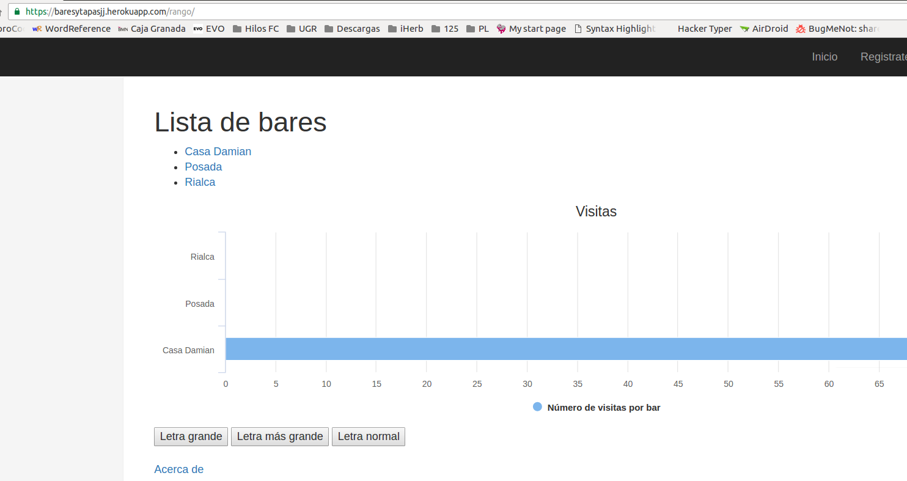
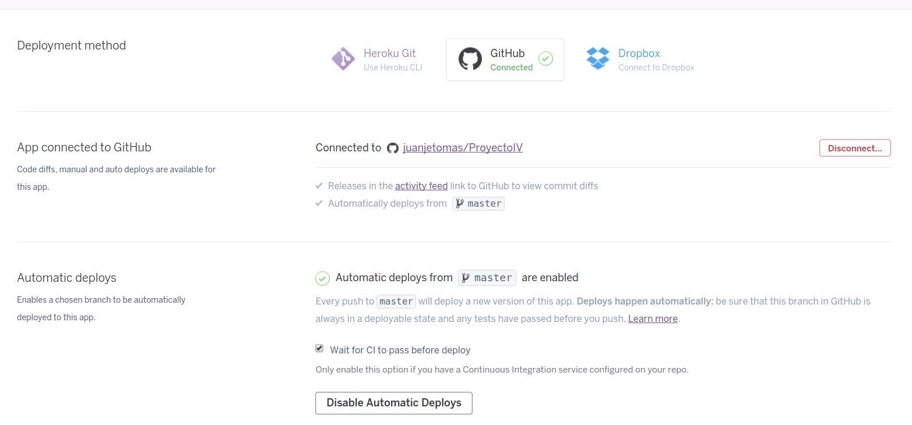
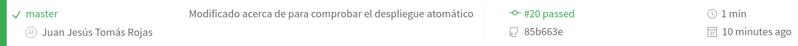
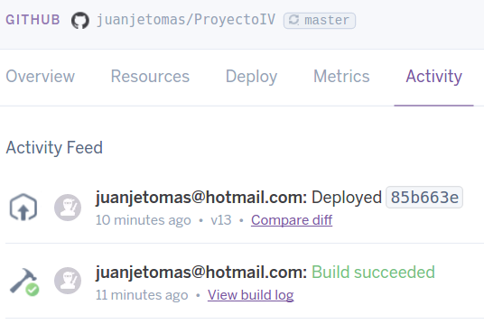
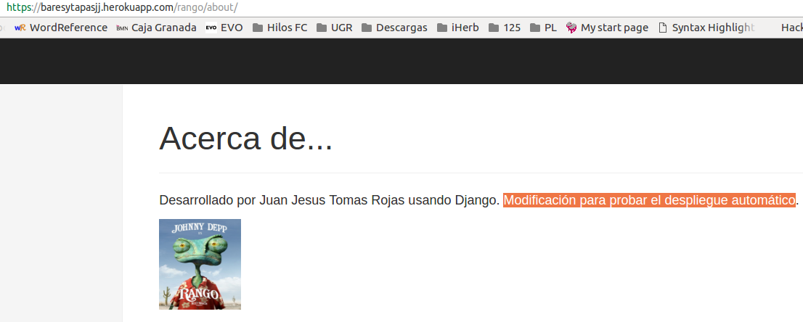
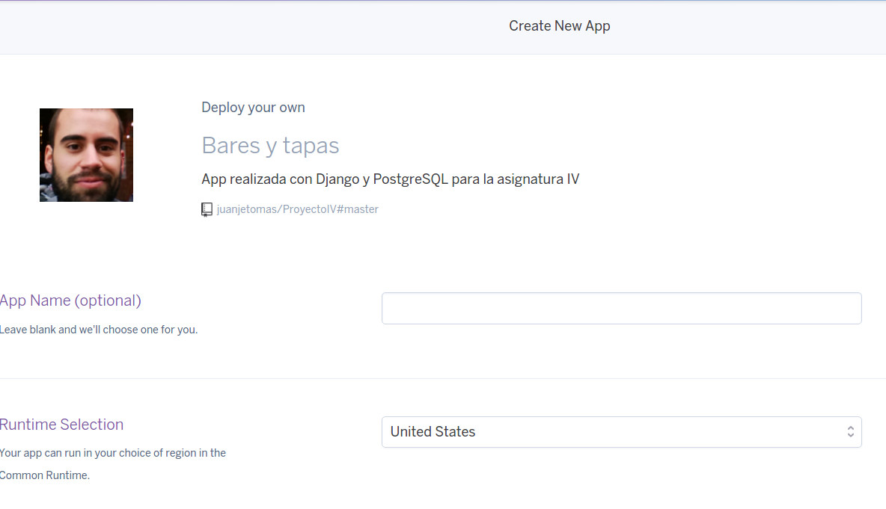

# Hito 3:Despliegue de una aplicación en un PaaS
## Errores previos
Tras la finalización del hito 2 y al intentar ejecutar la aplicación de nuevo, se recibe un error que no ocurría antes:
```bash
django.db.utils.ProgrammingError: permission denied for relation django_migrations
```
Esto es debido a que el usuario creado para las consultas no tiene derechos de propiedad en la base de datos, y se soluciona desde la consola de psql ejecutando:
```bash
GRANT ALL ON ALL TABLES IN SCHEMA public to baresytapasuser;
GRANT ALL ON ALL SEQUENCES IN SCHEMA public to baresytapasuser;
GRANT ALL ON ALL FUNCTIONS IN SCHEMA public to baresytapasuser;
```
## Integración continua
Aunque la integración continua en Travis CI formó parte del hito anterior, en éste se sigue usando como paso previo al despliegue, realizándose los test.
Se puede consultar en este badge: [](https://travis-ci.org/juanjetomas/ProyectoIV)

## Despliegue en PaaS
El PaaS que he elegido es Heroku. Se integra correctamente con Travis y además permite instanciar una base de datos PostgreSQL sin necesidad de introducir una tarjeta de crédito, por lo que se adapta a las necesidades del proyecto.

He seguido [este tutorial](https://devcenter.heroku.com/articles/deploying-python) de la página de Heroku.

En primer lugar he creado el archivo _runtime.txt_ con el siguiente contenido:
```
python-2.7.12
```
Aunque finalmente lo he cambiado a una versión más nueva por la inclusión de la interfaz REST:
```
python-3.5.2
```
Esto le indica a Heroku en qué versión de Python debe ejecutar la aplicación.

Y añadimos al _requirements.txt_:
```
gunicorn==19.6.0
```
Creamos el archivo _Procfile_ para indicar de qué manera se ejecuta la aplicación, con el siguiente contenido:
```
web: gunicorn tango_with_django_project.wsgi --log-file -
```

Este archivo indica a Heroku qué comandos se deben ejecutar por el dyno de nuestra aplicación. En este caso el servidor gunicorn con nuestra aplicación, que busca el fichero _wsgi.py_ en el directorio indicado.

Tras loguearnos en Heroku toolbelt, creamos la aplicación:



(Es recomendable añadir _--region eu_ en la creación de la app, queda pendiente la migración de la mostrada.)

Indicamos a Heroku la pass de la base de datos de Amazon a la que accede (más adelante se usará una dentro del propio PaaS):
```bash
heroku config:set PASSDBVARIABLE=****
```

Y realizamos el primer despliegue con:
```bash
git push heroku master
```



Se despliega correcamente y podemos acceder con el enlace:
https://baresytapasjj.herokuapp.com/

#### Uso de la base de datos de Heroku
Como hasta ahora la base de datos utilizada es una alojada en AWS, vamos a añadir una opción para que cuando la aplicación se ejecute en Heroku use su propia base de datos.

Instalamos el paquete _dj_database_url_ mediante pip:
```bash
pip install dj_database_url
```
Y lo añadimos al _requirements.txt_. Este paquete nos permite configurar la base de datos de la aplicación mediante una URL.

A continuación, en _settings.py_ se añade la configuración de la base de datos de Heroku mediante URL. A dicha URL se accede a traves de una variable de entorno que se define automáticamente por el propio Heroku.

```python
HEROKU_DEPLOY = os.getenv('DYNO_RAM')
if HEROKU_DEPLOY:
    db_from_env = dj_database_url.config(conn_max_age=500)
    DATABASES['default'].update(db_from_env)
```

Realizamos un push a Heroku, y a continuación:
```bash
heroku run python manage.py migrate
heroku run python populate_rango.py
```
_El último comando es opcional aunque es útil para comprobar que se puede leeer información de la BD correctamente._

Y ya podemos acceder a la aplicación usando la base de datos de Heroku:
https://baresytapasjj.herokuapp.com/



## Despliegue automático desde Github
En la pestaña deploy de nuestra aplicación en Heroku:
* Realizamos la conexión con Github
* Seleccionamos nuestro repositorio
* Activamos la opción "Wait for CI to pass before deploy" para que no se despliegue hasta que no se hayan pasado los test
* Y activamos "enable automatic deploy" para que de despligue la aplicación automáticamente con cada push




Tras esto, para comprobar que todo está correcto, modificamos el apartado "Acerca de" y realizamos un push a mi repositorio.







Tras pasar los test en Travis, la aplicación se despliega automáticamente y los cambios se ven reflejados.

## Botón 'deploy to Heroku'
Aunque en un principio el botón de _deploy to Heroku_ puede hacer pensar que abre la aplicación ya desplegada en Heroku, su función original es permitir que una persona pueda desplegar la aplicacion en su propia cuenta de Heroku con tan solo hacer click en el botón. Para ello se ha creado el archivo [app.json](https://github.com/juanjetomas/ProyectoIV/blob/master/app.json) con la siguiente información:
```json
{
  "name": "Bares y tapas",
  "description": "App realizada con Django y PostgreSQL para la asignatura IV",
  "logo": "https://avatars3.githubusercontent.com/u/9733173?v=3&u=3073beb3aa9b174b98e4e4c6e6e9f7a893e7cdd2&s=140",
  "image": "heroku/python",
  "repository": "https://github.com/juanjetomas/ProyectoIV",
  "keywords": ["python", "django" ],
  "addons": [ "heroku-postgresql" ]
}
```
Este fichero indica a la web de Heroku el logotipo que se va a usar como prseentación, el repositorio desde el que se desplegará la aplicación, el lenguaje y los addons (en este caso, la base de datos PostgreSQL).

Con esto, el botón que se ha añadido en el fichero [README.md](https://github.com/juanjetomas/ProyectoIV) de la rama máster (que es genérico y apunta a https://heroku.com/deploy) adquiere la funcionalidad deseada, pudiendo desplegar la aplicación en nuestra propia cuenta de Heroku así de fácil:



## Interfaz REST
Como objetivo secundario de este hito, se ha intregrado una interfaz REST en la aplicación en una función que admite tanto GET como POST, por lo que se podría considerar que realiza la función de 2. Dicho código se encuentra en el archivo [views.py](https://github.com/juanjetomas/ProyectoIV/blob/master/rango/views.py). Además, se han realizado algunos test para comprobar el funcionamiento de dicha interfaz, que están definidos en [tests.py](https://github.com/juanjetomas/ProyectoIV/blob/master/rango/tests.py).
