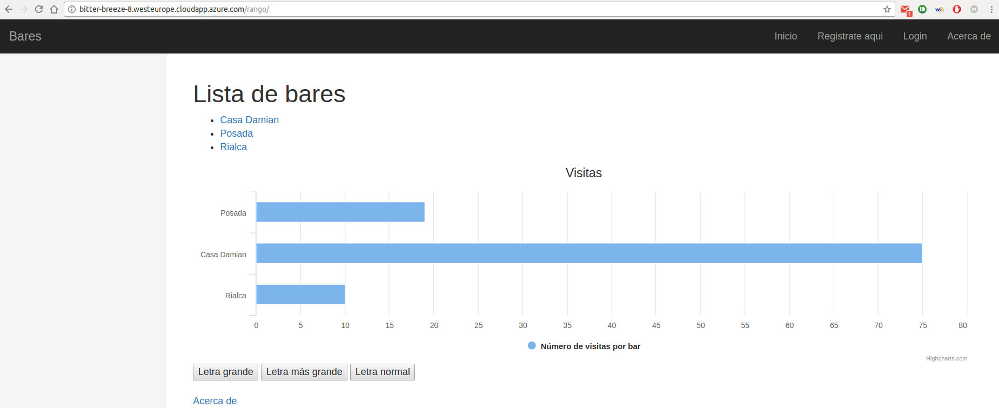

# Hito 5: Diseño del soporte virtual para el despliegue de una aplicación

### Configuración del entorno
He instalado Vagrant mediante la descarga de un fichero .deb de su [página oficial](https://www.vagrantup.com/downloads.html)

He instalado el plugin de Azure para evitar errores mediante:
```bash
vagrant plugin install vagrant-azure --plugin-version '2.0.0.pre1'
```
A continuación, el cliente de Azure:
```bash
npm install azure-cli -g
```
Es necesario loguearse realizando ``azure login`` y siguiendo las instrucciones, que consisten en copiar el código que se genera en la dirección del navegador que nos indica.

Una vez correctamente identificados, debemos obtener los siguienes id:
* tenant_id
* client_id
* client_secret
* subscription_id

[Este tutorial](https://www.terraform.io/docs/providers/azurerm/) explica como obtenerlos todos.

A continuación deben asignarse a sendas variables de entorno:
* AZURE_TENANT_ID
* AZURE_CLIENT_ID
* AZURE_CLIENT_SECRET
* AZURE_SUBSCRIPTION_ID

Tamibén es necesario instalar Virtualbox; [aquí](https://www.virtualbox.org/wiki/Linux_Downloads) se puede descargar e instalar.

Por último, necesitaremos instalar Fabric en función de nuestras necesidades siguiendo su [guía de instalación](http://www.fabfile.org/installing.html).

### Creación de la máquina virtual, provisionamiento y despliegue
Como ya se detalla en el [README del proyecto](https://github.com/juanjetomas/ProyectoIV/blob/master/README.md) la creación de la máquina virtual se realiza de esta forma:
```bash
vagrant up --provider=azure
```
Una vez se crea la máquina virtual, automáticamente se realiza el provisionamiento por Vagrant. Una vez terminado este proceso es momento de usar Fabric con la siguiente estructura:
```bash
fab -H usuariomv@url.de.la.mv funcion
```
Por lo que podremos instalar y lanzar la aplicación tal y como [se ha explicado](https://github.com/juanjetomas/ProyectoIV/blob/master/README.md#despliegue).



### Problemas de acceso a puertos
Aunque en la creación de la máquina virtual está especificado que el puerto HTTP (80) debe estar abierto, es posible que no lo esté, aunque se puede solucionar fácilmente (menús en inglés):
* Acceder al [portal de Azure](portal.azure.com)
* Click en all resources
* Buscar nuestra máquina virtual (si no se ha cambiado el nobre en el Vagrantfile, se llama MVbaresytapas) y hacer click en el resource group asignado.
* Una vez dentro, seleccionar el security network group
* Pulsar en Inbound security rules
* Click en Add y rellenar los capos con 80 en port range.
* Click OK

### Mantenimiento de la aplicación en ejecución
Si se analiza el código del [fabfile.py](https://github.com/juanjetomas/ProyectoIV/blob/master/fabfile.py) se puede entender la lógica que se ha seguido para mantener la aplicación siempre en ejecución:
* Se crea un script que comprueba si la aplicación se está ejecutando y si no lo está haciendo, la ejecuta.
* Se crea una regla Cron para que dicho script se ejecute cada minuto.

¿Por qué esta solución y no supervisor, por ejemplo? Como se puede ver en este [issue en Github](https://github.com/Supervisor/supervisor/issues/121) existe un bug en dicha aplicación, y pese a haber probado todas las soluciones dadas, no he logrado hacerlo funcionar, por lo que lo he implemetado yo mismo.

### Instalación de paquetes en Fabric
La idea de esta configuración siempre ha sido que la instalación de paquetes se realiza mediante Ansible y Fabric solo se usa para instalar la aplicación en sí y controlarla. En este caso he roto dicha idea ya que considero que no es adecuado instalar Postgresql en la fase de provisionamiento sin saber aún si el usuario usará una base de datos local, o remota. Por este motivo se instala (si es necesario) cuando se raliza la instalación de la aplicación.
