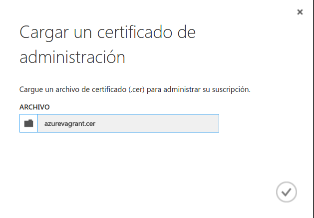

# Hito 5: Diseño del soporte virtual para el despliegue de una aplicación

### Configuración del entorno
He seguido [este tutorial](https://unindented.org/articles/provision-azure-boxes-with-vagrant/) para instalar y configurar las herramientas y los certificados de Azure tal y como se detalla a continuación:

He instalado el plugin de Azure para evitar errores mediante:
```bash
vagrant plugin install vagrant-azure --plugin-version '2.0.0.pre1'
```
A continuación, el cliente de Azure:
```bash
npm install azure-cli -g
```
Creamos las claves necesarias con:
```bash
openssl req -x509 -nodes -days 365 -newkey rsa:2048 -keyout ~/.ssh/azurevagrant.key -out ~/.ssh/azurevagrant.key
chmod 600 ~/.ssh/azurevagrant.key
openssl x509 -inform pem -in ~/.ssh/azurevagrant.key -outform der -out ~/.ssh/azurevagrant.cer
```
Y subimos el fichero _.cer_ al [antiguo portal de Azure](https://manage.windowsazure.com/) en Configuración-Certificados de administración:


